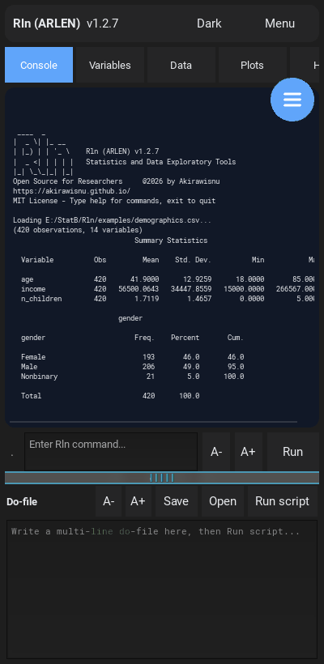
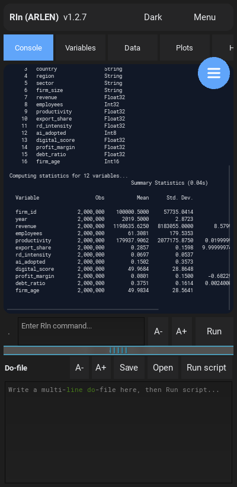
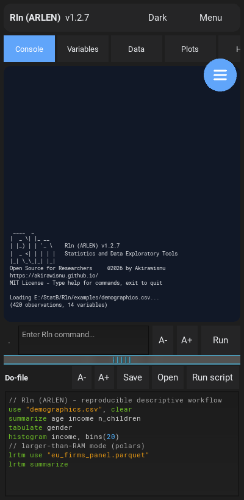
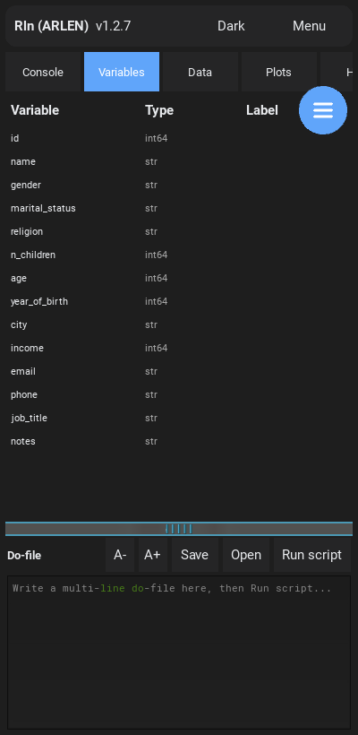
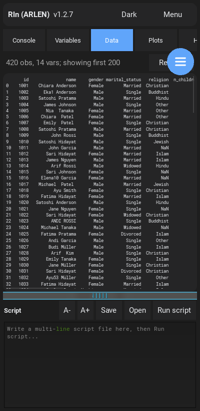
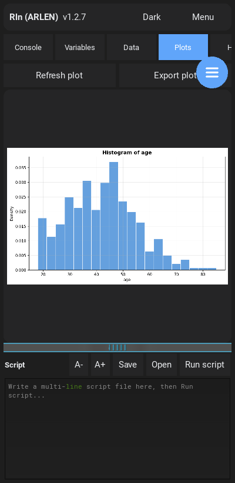

<div align="center">


# Rln (ARLEN)

### Statistics &amp; Data Exploratory Tools — free, offline, and in your pocket

[](LICENSE)




</div>

---

**Rln is a free, open-source, offline-capable data analysis tool for researchers.**

A compact, command-driven language for cleaning, exploring, describing, visualizing,
and modeling data — on your laptop **or** your phone. No per-seat licenses, no cloud, no
account. Your data never leaves your device.

> ### Dedication
> *To the scientists and researchers in our field, may powerful tools always be free and within reach.*
> *And to Marlene, the one who inspired me to build and help others* 🌱
>
> First public release — **14 June 2026**.

---

## Highlights

- 📂 **Read anything** — CSV, `.dta`, Excel (`.xlsx`/`.xls`), Parquet, JSON, and more
- 🔎 **Explore &amp; describe** — `describe`, `summarize`, `tabulate`, `correlate`
- 📈 **Charts** — `histogram`, `scatter`, `line`, `twoway`, rendered right in the app
- 🚀 **Larger-than-RAM (LRTM)** — stream millions of rows with [polars](https://pola.rs):
  **2,000,000 rows summarized in 0.04 s — on a phone** (see the demo above)
- 📝 **Reproducible scripts** — multi-line scripts with syntax highlighting
- 🧮 **Econometrics** — `regress`, `logit`, `probit`, `poisson`, `ivregress`, `didregress`
  (desktop today; the Android port is in progress)
- 📱 **Phone-first Android app** — the full engine, native and offline, dark mode, pinch-free
  zoom, and an always-visible script editor

### Design goals

Built for social scientists who work with survey, panel, and administrative data but
shouldn't have to pay per-seat for commercial software, stand up cloud infrastructure, or
learn the entire Python ecosystem before running a regression. One small, memorable command
language; the same scripts run identically on desktop and mobile.

## A 30-second tour

```text
use "examples/demographics.csv", clear
summarize age income n_children
tabulate gender
histogram age

* larger-than-RAM mode — millions of rows, streamed
lrtm use "eu_firms_panel.parquet"
lrtm summarize
```

## Screenshots

| Explore &amp; describe | Larger-than-RAM (2M rows) | Script editor |
|:---:|:---:|:---:|
|  |  |  |
| **Variables browser** | **Data browser** | **Plots** |
|  |  |  |

▶️ Full demo video: [`media/rln_demo.mp4`](media/rln_demo.mp4)

Desktop Mode


## Install

### Android
Download `rln-<version>-arm64-v8a-debug.apk` from the [Releases](../../releases) page, copy it
to your phone, and install (you'll need to allow installs from unknown sources). On first
**Open**, grant **All files access** so Rln can read your data files.

### Desktop (Windows)
Download the `rln-lite` build from [Releases](../../releases). Double-click **`Rln-GUI.bat`**
for the graphical app, or run `rln-lite.exe` for the command-line REPL.

### From source

```bash
git clone https://github.com/akirawisnu/Rln.git
cd Rln
pip install -r requirements.txt
python main.py --gui        # GUI
python main.py              # REPL
```

The Android APK is built with [buildozer](https://buildozer.readthedocs.io) /
python-for-android — see [`android/`](android/) for the recipe set (numpy, scipy, pandas,
matplotlib, kivy, **polars** for LRTM, and a from-source **statsmodels** recipe).

## License

[MIT](LICENSE) © 2026 Akirawisnu. Made with care, and meant to stay free.
