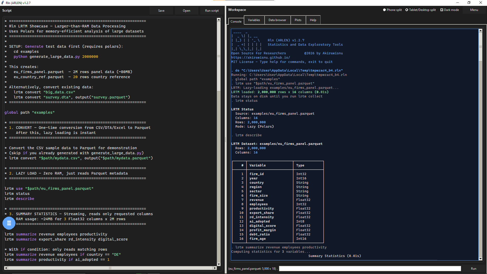

<div align="center">


# Rln (ARLEN)

### Statistics &amp; Data Exploratory Tools — free, offline, and in your pocket

[](LICENSE)


</div>

---

**Rln is a free, open-source, offline-capable data analysis tool for researchers.**

A compact, command-driven language for cleaning, exploring, describing, visualizing,
and modeling data — on your laptop **or** your phone. No per-seat licenses, no cloud, no
account. Your data never leaves your device.

A free, modern alternative to costly proprietary statistics packages: descriptive
statistics, cross-tabulation and correlation, the full regression family (OLS,
logit/probit, Poisson, GLM), panel and difference-in-differences estimators, robust and
clustered standard errors, post-estimation diagnostics, and publication-style charts —
with a **larger-than-RAM** mode for datasets of millions of rows that don't fit in memory.
Drive it from a text REPL, a desktop GUI, or the phone app — the same scripts run
identically on all three.

> ### Dedication
> *To the scientists and researchers in our field, may powerful tools always be free and within reach.*
> *And to Marlene, the one who inspired me to build and help others* 🌱
>
> First public release — **14 June 2026**.

---

## Highlights

- 📂 **Read anything** — CSV, `.dta`, Excel (`.xlsx`/`.xls`), Parquet, JSON, and more
- 🔎 **Explore &amp; describe** — `describe`, `summarize`, `tabulate`, `correlate`
- 📈 **Charts** — `histogram`, `scatter`, `line`, `twoway`, rendered right in the app
- 🎨 **Colour-coded explorer** — type-aware data grid (numbers, text, missing) in every
  version; `browse "file.parquet"` previews any file without touching your dataset
- 🚀 **Larger-than-RAM (LRTM)** — stream millions of rows with [polars](https://pola.rs):
  **2,000,000 rows summarized in 0.04 s — on a phone** (see the demo above)
- 📝 **Reproducible scripts** — multi-line scripts with syntax highlighting
- 🧮 **Econometrics** — `regress`, `logit`, `probit`, `poisson`, GLM, panel (`xtreg`),
  `didregress`, with robust/clustered SEs and diagnostics — **now on Android too**, via a
  built-in NumPy/SciPy backend (`ivregress` and panel random-effects remain desktop-only)
- 📱 **Phone-first Android app** — the full engine, native and offline, dark mode, pinch-free
  zoom, and an always-visible script editor

### Design goals

Built for social scientists who work with survey, panel, and administrative data but
shouldn't have to pay per-seat for commercial software, stand up cloud infrastructure, or
learn the entire Python ecosystem before running a regression. One small, memorable command
language; the same scripts run identically on desktop and mobile.

## What's new in 1.2.8

- 🧮 **Econometrics on mobile.** `regress` / `logit` / `probit` / `poisson` / GLM,
  `xtreg, fe`, `didregress` (TWFE), VIF and the heteroskedasticity tests now run on
  Android through a built-in, statsmodels-equivalent NumPy/SciPy backend (validated to
  ~1e-11). If a native statsmodels is present it's still used; otherwise the backend takes
  over automatically, so estimation no longer hard-fails on a phone.
- 🎨 **Colour-coded data explorer everywhere.** Numbers, text and missing values are
  type-coloured across the terminal, desktop and Android grids. `browse "file.parquet"`
  previews any file (csv/dta/xlsx/parquet/…) without disturbing the in-memory dataset.
- 👀 **Live Parquet preview (parquet-explorer style).** After `lrtm use`, the data browser
  immediately streams a colour-coded preview of the file — see what the data looks like
  before loading it — then explore the whole dataset once you `lrtm collect`. Works on
  desktop and Android, no pyarrow required.
- 📁 **Examples ready out of the box.** Bundled sample datasets are located automatically:
  `use "demographics.csv"` and `do "sample.do"` just work, and the file pickers open in the
  right folder. Point Rln at your own data with `set workdir "<path>"` (remembered between
  sessions).
- 🔗 **Fuzzy merge in every build.** `fuzzmerge` now falls back polyfuzz → rapidfuzz →
  stdlib, so approximate string joins work on lite and Android, not just the full build.
- 🩹 **Robustness fixes.** Larger-than-RAM `lrtm collect` / `sample` no longer require
  pyarrow; charts work in the lite desktop build (Pillow is now bundled); and a missing
  optional library reports the real reason instead of a misleading message.

## A 30-second tour

```text
use "examples/demographics.csv", clear
summarize age income n_children
tabulate gender
histogram age

* larger-than-RAM mode — millions of rows, streamed
lrtm use "eu_firms_panel.parquet"
lrtm summarize
```

## Screenshots

| Explore &amp; describe | Larger-than-RAM (2M rows) | Script editor |
|:---:|:---:|:---:|
|  |  |  |
| **Variables browser** | **Data browser** | **Plots** |
|  |  |  |

▶️ Full demo video: [`media/rln_demo.mp4`](media/rln_demo.mp4)

**Desktop GUI** — the same engine with a point-and-click front end:



## Documentation

- 🌐 **[Interactive docs &amp; download page](https://akirawisnu.github.io/Rln/)** — editions,
  install steps, demo video, capability matrix, and a searchable command reference. Served
  from [`index.html`](index.html) (enable GitHub Pages on the `main` branch to publish it).
- 📘 **[Lite Desktop &amp; Mobile guide](docs/Rln-LiteDesktop-Mobile-Guide.pdf)** — a PDF
  walkthrough focused on the two everyday editions.
- 📚 **[Full reference manual](Rln_Reference_Manual.pdf)** — every command, the expression
  language, and appendices (PDF).

## Install

### Android
Download `rln-<version>-arm64-v8a-debug.apk` from the [Releases](../../releases) page, copy it
to your phone, and install (you'll need to allow installs from unknown sources). On first
**Open**, grant **All files access** so Rln can read your data files.

### Desktop (Windows)
Download the `rln-lite` build from [Releases](../../releases). Double-click **`Rln-GUI.bat`**
for the graphical app, or run `rln-lite.exe` for the command-line REPL.

### From source

```bash
git clone https://github.com/akirawisnu/Rln.git
cd Rln
pip install -r requirements.txt
python main.py --gui        # GUI
python main.py              # REPL
```

The Android APK is built with [buildozer](https://buildozer.readthedocs.io) /
python-for-android — see [`android/`](android/) for the recipe set (numpy, scipy, pandas,
matplotlib, kivy, **polars** for LRTM, and a from-source **statsmodels** recipe).

## License

[MIT](LICENSE) © 2026 Akirawisnu. Made with care, and meant to stay free.
